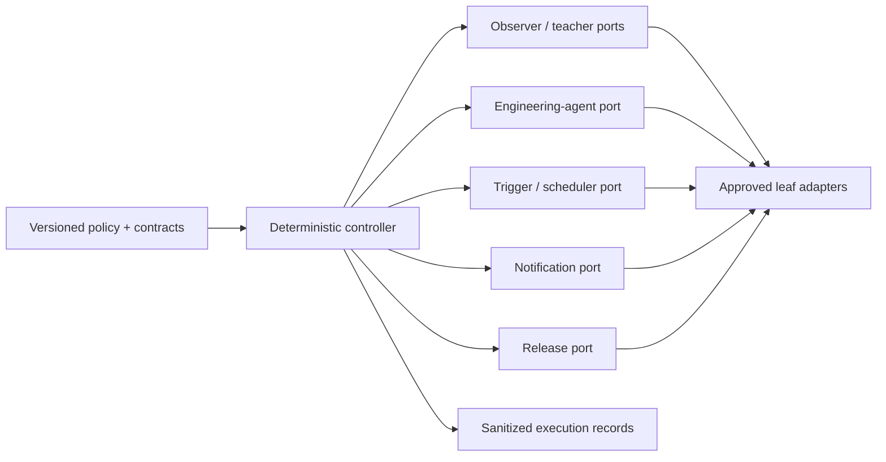

# Agent and provider interoperability

This architecture keeps one deterministic control plane while allowing multiple inference
providers, coding-agent runtimes, trigger hosts, notification systems, and deployment targets.
Portability is a verified contract property; it is not permission to dynamically load an arbitrary
extension or silently replace one behavior with another.

## Identities stay distinct

Evidence and policy never collapse these four identities:

| Identity | Example | Why it matters |
| --- | --- | --- |
| Role | observer, teacher, reviewer, executor | Defines the bounded responsibility. |
| Agent runtime | Codex, Claude Code, Gemini CLI, local runner | Determines instruction/tool integration and sandbox behavior. |
| Model provider | OpenAI, Anthropic, Google, local inference host | Determines API, data handling, availability, and billing. |
| Model/artifact | requested model ID or immutable weight digest | Identifies the evaluated behavior candidate. |

Core packages depend on roles and typed ports. Provider and runtime names appear in leaf adapters,
registries, evaluation reports, and provenance so abstraction never erases accountability.

## Control-plane boundaries



The controller owns state transitions, idempotency, attempt/time/cost limits, capability grants,
approval checks, and terminal outcomes. An adapter translates one external protocol and reports a
normalized result. It cannot expand its own authority or call another adapter outside the current
work order.

Effective capability is always the intersection of:

```text
registered adapter capability
∩ workflow grant
∩ work-order authorization
∩ current human/policy authorization
```

Missing capability fails explicitly. The controller does not silently substitute a provider,
weaken a schema, bypass a check, or infer authority from a model response.

## Product inference adapters

`ObserverModelPort` and `TeacherModelPort` are the stable product boundary. A provider adapter maps
the minimal verified request and strict response schema to its native API, then normalizes response,
usage, cancellation, timeout, refusal, quota, and redacted error outcomes. Sudoku facts, board
mutation, learner-band changes, lesson validation, and factual rendering remain outside adapters.

`config/provider-policy.json` registers security boundaries and candidate runtime profiles.
Provider-specific settings remain exact and hashed through the runtime registration. Common policy
still requires minimal packets, bounded output/deadline, request-storage control, no automatic
retry, semantic validation, and visible pause/stale behavior.

OpenAI is the first reference adapter. Anthropic, Google, and local/open-weight adapters must pass
the same conformance and comparative evaluation before a claim names them. Open-weight profiles
also bind the model-weight digest, quantization, inference server, prompt template, and relevant
hardware/runtime identity. API-shape compatibility alone is not conformance.

The reviewer cohort uses one frozen approved registration. Alternate registrations remain
owner/evaluation-only. Provider unavailability produces the existing visible pause; Coach v1 has no
automatic provider failover.

## Engineering-agent adapters

Repository state, not a conversation, is the handoff. A runner receives a bounded `WorkOrderV1`, an
isolated worktree, and brokered capabilities. It returns `WorkResultV1` plus sanitized evidence.
Imported prompts, repository text, issue/PR content, dependency metadata, tool output, and agent
output are untrusted data. Target-repository policy always governs.

Agent adapters may translate instruction discovery, tool calls, patch formats, cancellation, and
usage reporting. They do not receive ambient merge or production credentials. A separately
authorized broker validates the exact base/head/patch SHA and policy result before any external
mutation.

Future branches use `work/<work-package-id>-<short-topic>`. Provenance records the actual agent,
provider, model, and adapter versions rather than encoding a vendor in the branch name.

## Canonical instructions and tools

- Root and scoped `AGENTS.md` files are the substantive repository instruction hierarchy.
- `.agents/skills/*/SKILL.md` uses the open Agent Skills layout and remains the canonical skill.
- `CLAUDE.md`, `.claude/skills/`, Gemini settings, and future client files are thin discovery
  adapters that point to canonical content and are checked for drift.
- Deterministic scripts and CI enforce rules. Instruction files are context, not an enforcement
  boundary.
- A credential-free JSON/CLI exchange is the baseline tool protocol. MCP may expose the same
  tools/resources through a capability-negotiated adapter; MCP does not own application state,
  scheduling, or authorization.
- A2A is reserved for a real independently hosted remote-agent boundary. It is unnecessary for
  swapping the model behind an in-process port.

The entrypoint strategy follows the public [AGENTS.md](https://agents.md/) and
[Agent Skills](https://agentskills.io/specification) formats. Claude's
[documented AGENTS import](https://code.claude.com/docs/en/memory#agentsmd) and Gemini CLI's
[configurable context filename](https://github.com/google-gemini/gemini-cli/blob/main/docs/reference/configuration.md#context)
provide thin adapters. MCP usage follows the
[versioned protocol specification](https://modelcontextprotocol.io/specification/2026-07-28).

## Triggers, schedules, and notification

Trigger hosts normalize pull-request, push, manual, recurring, and operational events into
`TriggerEventV1`. The deterministic workflow owns at-least-once delivery, deduplication, leases,
concurrency, retries, dead-letter/terminal status, and notification policy. A scheduler UI or model
conversation is never the durable workflow state.

GitHub checks/comments are canonical for dependency-PR decisions. Chat/thread or email adapters may
summarize meaningful state changes, completion, required approval, or terminal failure. Unchanged
monitoring is quiet.

## Portability claims

The project may claim **provider-/agent-neutral architecture** when contract, dependency, and
adversarial fitness checks pass. It may claim compatibility with a named runtime/provider only
after that adapter passes conformance; live quality, latency, data-handling, and cost claims require
the separately authorized comparative evaluation. Exact prose equality across models is never a
conformance requirement.
