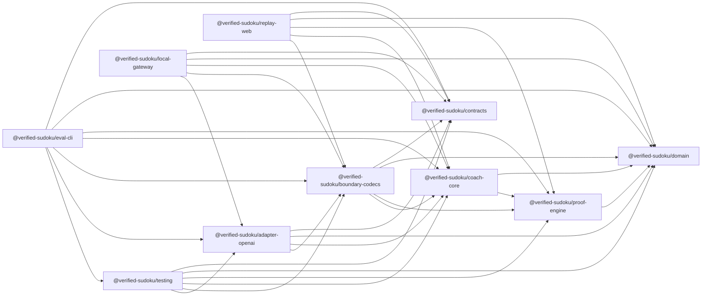

# System architecture

The directories exist as foundation boundaries; functional implementation begins only after the
foundation is accepted. Package names and allowed edges are checked against
`config/architecture.json`.

Arrows mean “may depend on.” Absence of an arrow is a prohibition. In particular, contracts and
domain are independent roots: transport shapes do not become domain truth, and domain values do
not acquire a schema-library dependency.

## Responsibilities

| Package | Owns | Must not own |
| --- | --- | --- |
| `@verified-sudoku/domain` | Immutable boards, candidates, branded IDs, techniques, learner bands, typed results, and ports' value vocabulary | Zod, frameworks, network, storage, provider SDKs, clock/random access |
| `@verified-sudoku/proof-engine` | Candidate derivation, canonical six-technique search, proofs, verification, and application | DTO decoding, teaching prose, model/provider behavior, accounts |
| `@verified-sudoku/coach-core` | Pure `decide`/`evolve`, cadence/intervention policy, model ports, semantic plan checks, and deterministic lesson rendering | HTTP SDKs, Firebase, React, Angular, wall-clock or random access |
| `@verified-sudoku/contracts` | Strict Zod schemas and versions for HTTP, storage, trace, replay, and model DTOs | Domain imports, Sudoku decisions, provider calls, persistence |
| `@verified-sudoku/boundary-codecs` | Exact-key decoding and explicit anti-corruption mapping between DTOs and trusted application values | Inventing defaults, proof decisions, provider transport, UI |
| `@verified-sudoku/adapter-openai` | Node-only Responses API observer/teacher implementations and provider error translation | Sudoku truth, rendering facts, identity, browser delivery |
| `@verified-sudoku/testing` | Generated fixtures, builders, fake clock/IDs/budget, adapter conformance, adversarial responses | Production data or credentials |
| `@verified-sudoku/replay-web` | Static React/Vite replay, architecture visualization, and accessibility | Provider dependency, secrets, production identity, misleading live behavior |
| `@verified-sudoku/local-gateway` | Loopback-only BYOK proxy for explicit local testing | Browser-delivered keys, production auth or application state |
| `@verified-sudoku/eval-cli` | Frozen, adversarial, comparative, and guarded live runners plus aggregate reports | Production traces, browser delivery, implicit spend |

## Runtime trust flow

1. A host submits an exact-schema board action with a stable command ID and expected revision.
2. Boundary codecs reject unknown, oversized, or unsupported input before creating domain values.
3. The proof engine creates independently verifiable opportunities from the immutable board.
4. Coach core reduces the action, records effects, and projects the smallest observation packet.
5. An observer may choose silence or reference a registered opportunity; a teacher may arrange only
   registered proof/fact/template references.
6. Schema, reference, proof, board revision, pacing, and render constraints all pass before display.
7. Deterministic templates render factual content. Only a later player command can alter the board.
8. Invalid, stale, unavailable, or over-budget work becomes a typed `paused` or `stale` outcome.

## Imperative shell and ports

Network, time, IDs, persistence, models, budgets, and telemetry enter through ports. The application
uses `decide(state, command) -> events/effects` and `evolve(state, event) -> state`. A shell executes
effects and persists with compare-and-swap revisions; it never holds a database transaction open
during a model call. Stable command and call IDs make retries idempotent, and results for an older
revision are discarded.

The public replay composes browser-safe packages without `@verified-sudoku/adapter-openai`. The
local gateway and private host may compose the Node-only adapter. Evaluation tooling may compose
all packages, but live credentials are available only for a separately authorized, spend-capped
run. OpenAI owns no application state.

The public repository never imports from Sudoku World. The private host consumes immutable public
release artifacts and records contract/hash parity; its auth, consent, retention, deletion, budget,
telemetry, Firebase, Angular, and invite adapters remain private.
