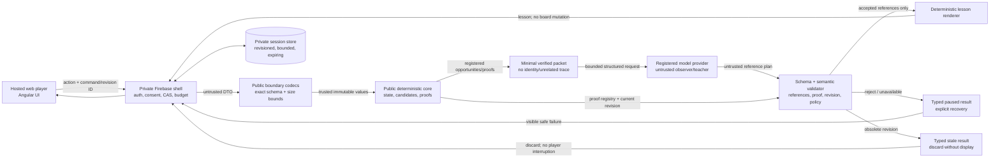

# Trust and data boundaries

## Zones

| Zone | Trust level | Allowed information | Prohibited information |
| --- | --- | --- | --- |
| Deterministic core | Factual authority | Validated board snapshot, canonical candidates, proof graph, coarse learner state | Provider SDKs, account identity, unvalidated model claims |
| Provider adapter | Untrusted external boundary | One minimal verified observation or selected proof packet, prompt/schema/model versions | Full account profile, unrelated games, hidden notes history, credentials in payloads |
| Host product | Auth and lifecycle authority | Consent, access, session ownership, quotas, deletion, private telemetry | Delegating Sudoku correctness to the model |
| Static replay | Public and inspectable | Independently generated fixtures and curated synthetic structured responses | Live model key, live calls, production traces, misleading “live” labels |
| Public repository | Permanent disclosure | Source, public prompts, generated fixtures, aggregate reports, decisions and evidence | Secrets, private source, participant/private-account identities, raw user/provider traces, private reasoning |

## Planned end-to-end trust flow

The trust boundary is crossed twice: inbound host data is decoded before domain construction, and
model output is decoded and semantically rechecked against current deterministic authority before
rendering. Neither a provider nor the browser owns application state. Provider, validation, policy, or
operational rejection returns a visible typed `paused` outcome. An obsolete revision returns a
typed `stale` outcome that is discarded without display. Neither path substitutes model prose or
mutates the board.

## Threats and required response

| Threat or failure | Required control |
| --- | --- |
| Model names a candidate, cell, digit, or technique not in the proof packet | Semantic rejection before rendering; typed visible pause and explicit recovery choices |
| Response belongs to an older board | Revision/fingerprint rejection; never interrupt the current board |
| Valid structure tries to reveal more than the lesson stage permits | Lesson-policy rejection and adversarial regression fixture |
| Provider is slow, unavailable, over quota, or over budget | Bounded timeout and visible paused state; no automatic retry loop |
| Browser bundle gains provider access | Dependency check and static build inspection fail |
| Evaluation data contains production content | Public-boundary check fails; stop publication and follow incident runbook |
| Logs or errors contain request/response content | Sentinel tests fail; record only bounded codes, versions, counts, and durations |
| Public report overstates small-cohort evidence | Acceptance and PR review fail; retain denominators and limitations |

## Runtime model data

The future observer receives coarse progress/struggle signals and opaque verified opportunity
summaries. The teacher receives only the selected verified proof packet, coarse learner band, and
current lesson outcome. Neither receives Firebase identity, contact data, puzzle-library identity,
complete action history, or a retained conversation.

Provider storage must be disabled when supported. Provider-side safety/abuse retention and policy
remain external facts that the private host must disclose and reassess before live use.

The reviewer cohort freezes one approved provider registration for each model role. Candidate
adapters may run only in authorized evaluation. There is no automatic failover: an outage or
incompatible response visibly pauses Coach Mode rather than changing provider or behavior identity.

## Evidence and logging

Public examples are synthetic. Production systems may retain bounded private traces only under an
explicit consent, expiry, deletion, and access contract. Public outputs reduce those traces to
reviewed aggregates. Logs use allowlisted reason codes and metrics; they never serialize boards,
notes, prompts, responses, identifiers, or arbitrary exceptions.
